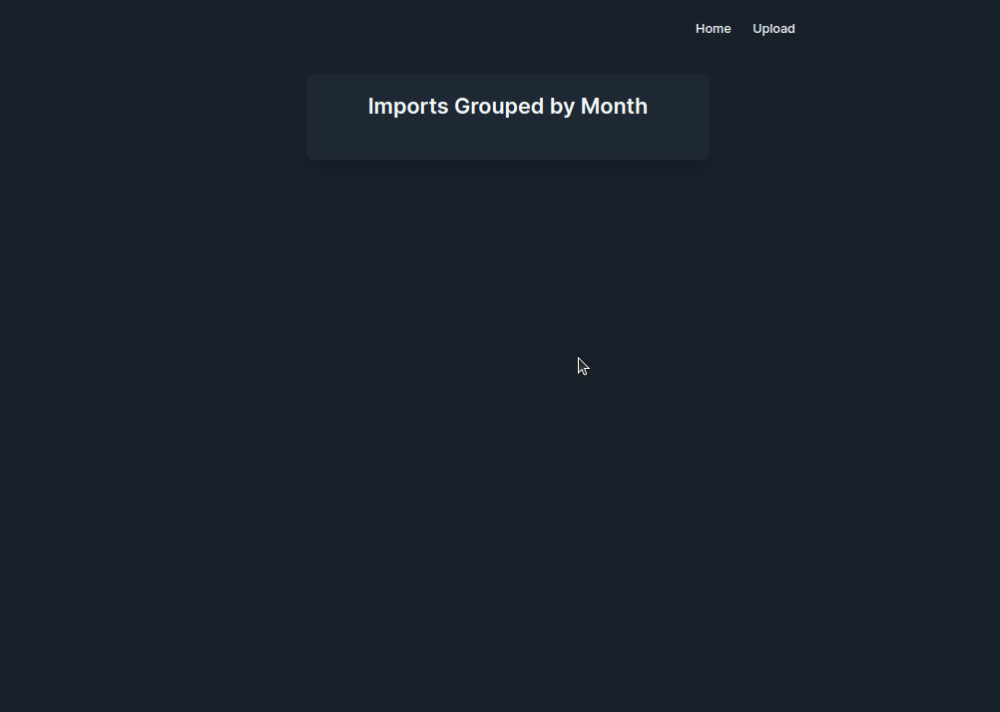

# Shift Spectra

Shift Spectra is a comprehensive solution for visualizing work shifts made by pharmacy collaborators.

<p style="text-align: center">
    
</p>

## Objective

The objective of this project is to build a web application to visualize the schedules made by employees of a pharmacy.
Each employee makes 4 clockings per day, representing different times of the day. The application consumes a CSV file
containing the clockings of several employees made in the last days and stores them in a database. This consumption is
done after the user uploads one or more CSV files with the clockings.

## Description

This project aims to provide a platform for pharmacy collaborators to log their work shifts and visualize them in an
organized manner. The backend is built using FastAPI, ensuring high performance and easy scalability, while the frontend
offers a sleek user interface for seamless interaction.

## Requirements

- Docker
- Docker Compose

## Installation

1. Clone the repository:

```bash
git clone git@github.com:leonardomarcao/shift-spectra.git
```

2. Navigate to the project's root directory.
3. Build and run the Docker containers for both frontend and backen

```bash
docker-compose up --build
```

Once the containers are up:
The backend API should be accessible at http://localhost:8000.
The frontend application should be available at http://localhost:3000.

## Demo

<p style="text-align: center">
    
</p>

## Documentation

- [Backend](backend%2FREADME.md)
- [Frontend](frontend%2FREADME.md)